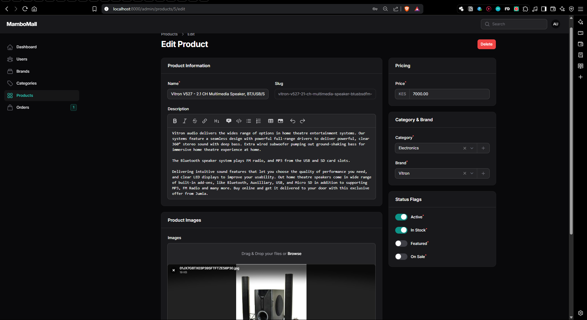

# Mambo-Mall E-commerce Application


Mambo-Mall is a modern e-commerce platform built with Laravel 12 and Filament 3, featuring a powerful admin panel for managing products, categories, brands, orders, and customers.

## Features

- **Admin Panel**:
  - User management with role-based permissions
  - Product catalog management
  - Category and brand organization
  - Order processing system
  - Customer relationship management
  - Analytics dashboard

- **E-commerce Functionality**:
  - Flexible shipping options
  - Payment status tracking
  - Order lifecycle management
  - Product image handling

## Technology Stack

- **Backend**: Laravel 12
- **PHP**: 8.2+
- **Admin Panel**: Filament 3
- **Frontend**: Livewire, Alpine.js, Tailwind CSS
- **Database**: MySQL/PostgreSQL/SQLite

## Installation Guide

### Prerequisites
- PHP 8.2+
- Composer
- Node.js 18+
- Database (MySQL/PostgreSQL/SQLite)
- Web server (Apache/Nginx)

### Step-by-Step Installation

1. **Clone the repository**:
   ```bash
   git clone https://github.com/ghetto-techie/MamboMall-Ecommerce-App.git
   cd MamboMall-Ecommerce-App
   ```

2. **Install PHP dependencies**:
   ```bash
   composer install
   ```

3. **Install JavaScript dependencies**:
   ```bash
   npm install
   npm run build
   ```

4. **Configure environment**:
   ```bash
   cp .env.example .env
   php artisan key:generate
   ```
   Edit the `.env` file with your database credentials:
   ```env
   DB_CONNECTION=mysql
   DB_HOST=127.0.0.1
   DB_PORT=3306
   DB_DATABASE=mambomall
   DB_USERNAME=root
   DB_PASSWORD=
   ```

5. **Run database migrations**:
   ```bash
   php artisan migrate --seed
   ```

6. **Create symbolic link for storage**:
   ```bash
   php artisan storage:link
   ```

7. **Start the development server**:
   ```bash
   php artisan serve
   ```

8. **Access the admin panel**:
   Visit `http://localhost:8000/admin` and log in with:
   - Email: `admin@example.com`
   - Password: `password`


Example screenshot section:

### Admin Panel Views

#### Dashboard


#### Users
- **Table View:**  
  
<!-- - **Form Page:**  
  
- **View Page:**  
  
- **Widgets:**  
   -->

#### Brands
- **Table View:**  
  
<!-- - **Form Page:**  
   -->

#### Category
- **Table View:**  
  
<!-- - **Form Page:**  
   -->

#### Products
- **Table View:**  
  
- **Form Page:**  
  
- **View Page:**  
  

#### Orders
- **Table View:**  
  
- **Form Page:**  
  
- **View Page:**  
  (screenshots/order-view-2.png)

## Project Structure

```
MamboMall-Ecommerce-App/
├── app/
│   ├── Filament/
│   │   └── Resources/       # Filament resource classes
│   ├── Models/              # Eloquent models
│   └── Providers/           # Service providers
├── config/                  # Configuration files
├── database/
│   ├── factories/           # Model factories
│   ├── migrations/          # Database migrations
│   └── seeders/             # Database seeders
├── public/                  # Publicly accessible files
├── resources/
│   ├── views/               # Blade templates
│   └── css/                 # Frontend assets
├── routes/                  # Application routes
├── screenshots/             # Documentation screenshots
├── tests/                   # Automated tests
├── .env.example             # Environment example
└── README.md                # Project documentation
```

## Contributing

Contributions are welcome! Please follow these steps:

1. Fork the repository
2. Create a new branch (`git checkout -b feature/your-feature`)
3. Commit your changes (`git commit -am 'Add some feature'`)
4. Push to the branch (`git push origin feature/your-feature`)
5. Create a new Pull Request

## License

This project is open-source software licensed under the MIT license.

## Support

For support or feature requests, please [open an issue](https://github.com/ghetto-techie/MamboMall-Ecommerce-App/issues) on GitHub.

---

**Project Status**: Admin panel development in progress. Frontend implementation upcoming.